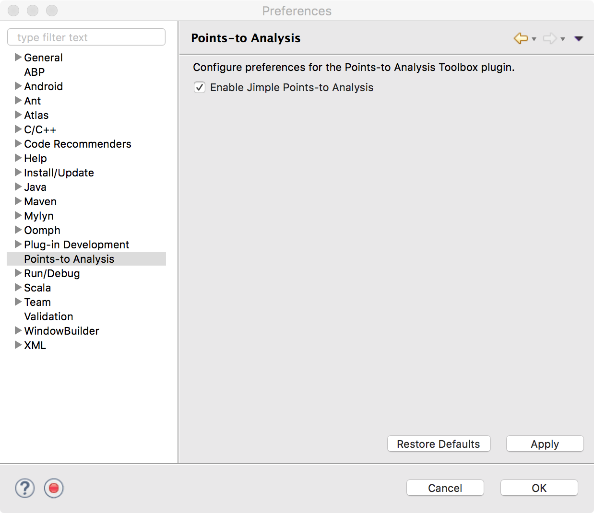
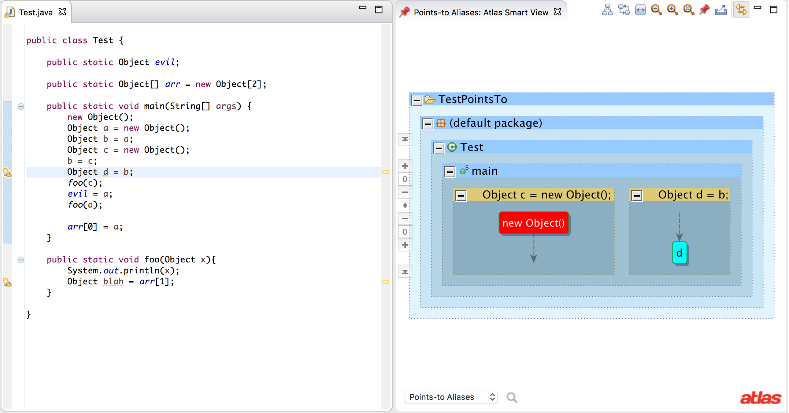

If you haven't already, [install](/points-to-toolbox/install) the Points-to Toolbox plugin into Eclipse.

## Configuration
After installing the `Points-to Toolbox` navigate to `Eclipse` &gt; `Preferences` (or `Window` &gt; `Preferences`). Select `Points-to Toolbox` and check the `Enable Jimple Points-to Analysis` checkbox.

Note: Currently "Jimple Points-to Analysis" analyzes both Java and Java bytecode.

Navigate to `Atlas` &gt; `Manage Project Settings`, select the project to analyze and press `OK`. Navigate to `Atlas` &gt; `Re-Map Workspace` to regenerate the program graph. If points-to analysis is enabled it will be invoked automatically after the workspace has been mapped.

After the points-to analysis is complete, a Smart View can be opened to view the results.  Navigate to `Atlas` &gt; `Open Smart View`.  In the Smart View selection window select `Points-to Aliases`, `Points-to Array Components`, or `Points-to Array Component Aliases`.

In a program graph or source editor, select the reference to display points-to results for and the Smart View will automatically update with the aliases and instantiations for the given selection as shown in the image below.

